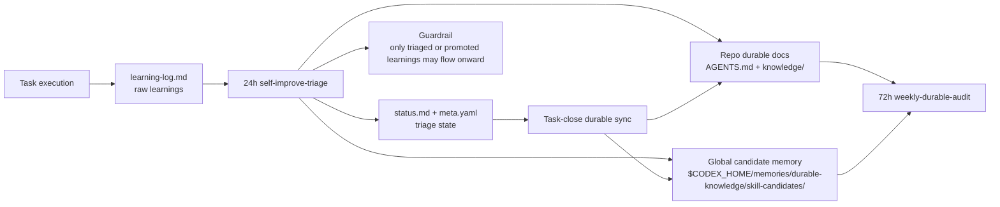

# Self-Improving Codex

Use this skill when a Codex task surfaces non-trivial errors, corrections, missing capabilities, undocumented repo conventions, or repeatable workflows that should be captured before they fade into chat history.

## Preconditions
- Prefer repositories that already use:
  - `AGENTS.md`
  - `docs/work/`
  - `knowledge/`
- If those surfaces do not exist yet, use `agents-md-context-manager` first.

## Read first
1. `AGENTS.md`
2. `docs/work/.current`
3. the active task's `meta.yaml`, `status.md`, and `decisions.md`
4. the active task's `learning-log.md` when it already exists

## Capture triggers
- unexpected command, tool, runtime, or integration failure
- user correction or clarified requirement
- self-correction after discovering the earlier approach was wrong
- newly discovered repo convention or undocumented rule
- repeatable workflow worth simplifying or reusing
- missing capability that blocked progress

## Overall mechanism
This skill is the task-time capture layer in a four-stage loop:
1. Task-time capture
   - raw events go into `docs/work/<task>/learning-log.md`
2. 24-hour triage
   - the `self-improve-triage` automation dedupes, classifies, and promotes only confirmed learnings
3. Task-close durable sync
   - `durable-knowledge-maintainer` maps promoted learnings into `AGENTS.md`, `knowledge/`, and task metadata
4. 72-hour durable audit
   - `weekly-durable-audit` checks for stale pending learnings, missing capture adoption, stale sources, and candidate drift

## Architecture

## Storage model
- `learning-log.md`: raw event capture
- `status.md`: short derived summary for the active task
- `meta.yaml`: durable review status and follow-ups
- `AGENTS.md` + `knowledge/`: stable repo rules and long-term knowledge
- `$CODEX_HOME/memories/durable-knowledge/skill-candidates/`: cross-task or cross-repo reusable workflow evidence

## Workflow
1. Resolve the active task through `docs/work/.current`.
2. Create or update `docs/work/<task>/learning-log.md`.
3. Capture only non-trivial learnings.
   - skip noise such as obvious typos, transient retries with no insight, or details already captured elsewhere
4. Append or update an entry using the fixed schema:
   - `id`
   - `type`
   - `logged_at`
   - `status`
   - `trigger`
   - `summary`
   - `details`
   - `related_files`
   - `pattern_key`
   - `promotion_target`
   - `see_also`
5. Reuse the same `pattern_key` when the same workflow or failure pattern appears across tasks.
6. Keep `status.md` aligned.
   - summarize new raw entries under `Learning Capture`
   - summarize candidate or durable-doc destinations under `Promotion Queue`
   - do not duplicate full event detail in `status.md`
7. Triage each entry deliberately.
   - `pending`: captured but not yet confirmed
   - `triaged`: confirmed and mapped to the right durable target
   - `promoted`: durable docs or global candidate records were actually updated
   - `dismissed`: non-durable, superseded, or not worth keeping
8. Promote safely.
   - repo-local durable rules and knowledge updates go through `durable-knowledge-maintainer`
   - cross-task or cross-repo workflows go through `skill-candidate-harvester`
   - raw `pending` entries must not update `AGENTS.md` directly
9. Before a task is marked complete, ensure relevant learning entries are no longer `pending`.

## Entry conventions
- `type` should be one of:
  - `error`
  - `correction`
  - `workflow`
  - `convention`
  - `missing_capability`
- `trigger` should be one of:
  - `unexpected_command_failure`
  - `unexpected_tool_failure`
  - `user_correction`
  - `self_correction`
  - `repo_convention_discovered`
  - `better_repeatable_workflow`
  - `missing_capability`
- `promotion_target` examples:
  - `knowledge-doc:pitfalls`
  - `knowledge-doc:current-state`
  - `skill-candidate:installed-skill-copy-sync`
  - `none`

## Hard rules
1. Do not treat every failure as a learning; only keep durable or reusable insight.
2. Do not store raw learnings only in chat.
3. Do not let `status.md` become a duplicate event log.
4. Do not promote an unconfirmed entry into `AGENTS.md` or a global skill candidate.
5. Do not invent recurrence; use `see_also` and `pattern_key` only when the linkage is real.

## Resources
- Entry template: `assets/learning-log-template.md`
- Triage and promotion guidance: `references/triage-and-promotion.md`
